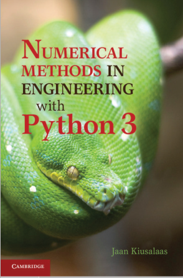
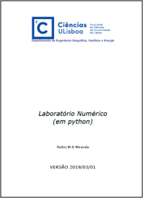

@def title = "Início"
@def tags = ["syntax", "code"]

# Métodos Numéricos Computacionais (EEU019)

*Professora: Andressa dos Santos Nicolau*
\\
*Monitor: João Victor Sigaud*

\tableofcontents <!-- you can use \toc as well -->
**Sejam bem vindos ao site da disciplina EEU019: Métodos Numéricos Computacionais. Este portal servirá como um complemento das aulas presenciais.**

@@colbox-yellow
Qualquer um pode ajudar a melhorar a página.
\\
Se tiver alguma idéia interessante não deixe de compartilhar.
\\
Reporte qualquer tipo de erro.
@@


<!-- This section is meant as a refresher if you're new to Franklin.
Have a look at both how the website renders and the corresponding markdown (`index.md`).
Modify at will to get a feeling for how things work!

Ps: if you want to modify the header or footer or the general look of the website, adjust the files in
* `src/_css/` and
* `src/_html_parts/`. -->

## Ementa

### Introdução aos erros numéricos
* Conversão de bases
* Tipos de Erros: Erros de Truncamento, Erros de arredondamentos
* Propagação de Erros

### Interpolação
* Interpolação Linear, Quadrática, Lagrange e Spline Cubico

### Diferenciação Numérica – diferenças Finitas

* Construção de formulas de diferença usando séries de Taylor
* Técnicas gerais para construção de esquemas de Diferenças finitas
* Grades não uniformes

### Integração Numérica

* Regra de Simpson e Trapezoidal
* Análise de Erros
* Regra trapezoidal com Correlação-End
* Integração de Romberg e Extrapolação Richardson
* Quadrante adaptativo
* Quadrante de Gauss


<!-- ## Cronograma -->


<!-- The [standard markdown syntax](https://github.com/adam-p/markdown-here/wiki/Markdown-Cheatsheet) can be used such as titles using `#`, lists:

* element with **bold**
* element with _emph_

or code-blocks `inline` or with highlighting (note the `@def hascode = true` in the source to allow [highlight.js](https://highlightjs.org/) to do its job):

```julia
abstract type Point end
struct PointR2{T<:Real} <: Point
    x::T
    y::T
end
struct PointR3{T<:Real} <: Point
    x::T
    y::T
    z::T
end
function len(p::T) where T<:Point
  sqrt(sum(getfield(p, η)^2 for η ∈ fieldnames(T)))
end
```

You can also quote stuff

> You must have chaos within you to ...

or have tables:

| English         | Mandarin   |
| --------------- | ---------- |
| winnie the pooh | 维尼熊      |

Note that you may have to do a bit of CSS-styling to get these elements to look the way you want them (the same holds for the whole page in fact). -->

<!-- ### Symbols and html entities -->

<!-- If you want a dollar sign you have to escape it like so: \$, you can also use html entities like so: &rarr; or &pi; or, if you're using Juno for instance, you can use `\pi[TAB]` to insert the symbol as is: π (it will be converted to a html entity).[^1]

If you want to show a backslash, just use it like so: \ ; if you want to force a line break, use a ` \\ ` like \\ so (this is on a new line).[^blah]

If you want to show a backtick, escape it like so: \` and if you want to show a tick in inline code use double backticks like ``so ` ...``.

Footnotes are nice too:

[^1]: this is the text for the first footnote, you can style all this looking at `.fndef` elements; note that the whole footnote definition is _expected to be on the same line_.
[^blah]: and this is a longer footnote with some blah from veggie ipsum: turnip greens yarrow ricebean rutabaga endive cauliflower sea lettuce kohlrabi amaranth water spinach avocado daikon napa cabbage asparagus winter purslane kale. Celery potato scallion desert raisin horseradish spinach carrot soko. -->

## Pré-requisitos
Para cursar a disciplina será necessário pelo menos uma linguagem de programação. A linguagem indicada é o Python, uma vez que será revisitada e serão introduzidas novas bibliotecas.
### Instalação Python.
Para fazer o download do Python segue o [**link**](https://www.python.org/downloads/).

@@colbox-red

**Atenção!** Quando for instalar o Python não se esqueça marcar a seguinte caixinha.
@@

~~~
<div class="row">
  <div class="container">
    
    <p>
    Marque a opção para adicionar o Python  no PATH.
    <div style="clear: both"></div>      
  </div>
</div>
~~~
### Instalação bibliotecas

Para instalar bibliotecas, procure por **cmd** ou **Prompt de comando** na aba de navegação do Windows. Em seguida digite: pip install \bolditalic{nome da biblioteca}.
\\
Dentre as bibliotecas que serão utilizadas temos:
\\
* [Numpy](https://numpy.org/install/)
* [Matplotlib](https://matplotlib.org/stable/users/getting_started/index.html#installation-quick-start)
* [Sympy](https://docs.sympy.org/latest/install.html#installation)
* [Scipy](https://scipy.org/install/)
* [Jupyter Notebook](https://jupyter.org/install)

### Google colab
Caso não queira instalar o Python no seu computador, uma alternativa é usar o [colab](https://colab.research.google.com/), para isso basta ter uma conta no google. E todas as bibliotecas já estão contidas nele, só é necessario que as importe. O que é feito pelo colab fica salvo no [Google drive](https://drive.google.com/drive/u/0/my-drive).

<!-- ### Divs

It is sometimes useful to have a short way to make a part of the page belong to a div so that it can be styled separately.
You can do this easily with Franklin by using `@@divname ... @@`.
For instance, you could want a blue background behind some text.

@@colbox-blue
Here we go! (this is styled in the css sheet with name "colbox-blue").
@@

Since it's just a `<div>` block, you can put this construction wherever you like and locally style your text. -->

<!-- ### LaTeX and Maths

Essentially three things are imitated from LaTeX

1. you can introduce definitions using `\newcommand`
2. you can use hyper-references with `\eqref`, `\cite`, ...
3. you can show nice maths (via KaTeX)

The definitions can be introduced in the page or in the `config.md` (in which case they're available everywhere as opposed to just in that page).
For instance, the commands `\scal` and `\R` are defined in the config file (see `src/config.md`) and can directly be used whereas the command `\E` is defined below (and therefore only available on this page):

\newcommand{\E}[1]{\mathbb E\left[#1\right]}

Now we can write something like

$$  \varphi(\E{X}) \le \E{\varphi(X)}. \label{equation blah} $$

since we've given it the label `\label{equation blah}`, we can refer it like so: \eqref{equation blah} which can be convenient for pages that are math-heavy.

In a similar vein you can cite references that would be at the bottom of the page: \citep{noether15, bezanson17}.

**Note**: the LaTeX commands you define can also incorporate standard markdown (though not in a math environment) so for instance let's define a silly `\bolditalic` command.

\newcommand{\bolditalic}[1]{_**!#1**_} <!--_ ignore this comment, it helps atom to not get confused by the trailing underscore when highlighting the code but is not necessary.-->

<!-- and use it \bolditalic{here for example}.

Here's another quick one, a command to change the color:

\newcommand{\col}[2]{~~~<span style="color:~~~#1~~~">~~~!#2~~~</span>~~~}

This is \col{blue}{in blue} or \col{#bf37bc}{in #bf37bc}.

### A quick note on whitespaces

For most commands you will use `#k` to refer to the $k$-th argument as in LaTeX.
In order to reduce headaches, this forcibly introduces a whitespace on the left of whatever is inserted which, usually, changes nothing visible (e.g. in a math settings).
However there _may be_ situations where you do not want this to happen and you know that the insertion will not clash with anything else.
In that case, you should simply use `!#k` which will not introduce that whitespace.
It's probably easier to see this in action:

\newcommand{\pathwith}[1]{`/usr/local/bin/#1`}
\newcommand{\pathwithout}[1]{`/usr/local/bin/!#1`}

* with: \pathwith{script.jl}, there's a whitespace you don't want 🚫
* without: \pathwithout{script.jl} here there isn't ✅

### Raw HTMLbold

You can include raw HTML by just surrounding a block with `~~~`.
Not much more to add.
This may be useful for local custom layouts like having a photo next to a text in a specific way. -->

<!-- ~~~
<div class="row">
  <div class="container">
    
    <p>
    Marine iguanas are truly splendid creatures. They're found on the Gálapagos islands, have skin that basically acts as a solar panel, can swim and may have the ability to adapt their body size depending on whether there's food or not.
    </p>
    <p>
    Evolution is cool.
    </p>
    <div style="clear: both"></div>      
  </div>
</div>
~~~

**Note 1**: again, entire such blocks can be made into latex-like commands via `\newcommand{\mynewblock}[1]{...}`.

**Note 2**: whatever is in a raw HTML block is *not* further processed (so you can't have LaTeX in there for instance). A partial way around this is to use `@@...` blocks which *will* be recursively parsed. The following code gives the same result as above with the small difference that there is LaTeX being processed in the inner div.

@@row
@@container
@@left  @@
@@
Marine iguanas are **truly splendid** creatures. They're not found in equations like $\exp(-i\pi)+1$. But they're still quite cool. -->
<!-- ~~~
<div style="clear: both"></div>
~~~
@@ --> 

## Forma de avaliação

<!-- Here are a few empty pages connecting to the menu links to show where files can go and the resulting paths. (It's probably best if you look at the source folder for this).

* [menu 1](/menu1/)
* [menu 2](/menu2/)
* [menu 3](/menu3/) -->
  
## Listas de exercicios
Neste [link](https://drive.google.com/drive/folders/1UOh8y9Y3vtNBY4IW-5IFBf8w35NTdtee?usp=sharing) serão postadas as listas, que deverão ser entregues pelo classroom da turma.
\\
* Lista 1: Conversão de base. Entrega dia 29/08/2023.


## Bibliografia


<!-- ~~~
<div class="image-container">
  <div>
    
    <p></p>
  </div>
  <div>
    
    <p></p>
  </div>
  <div>
    
    <p></p>
  </div>
  <div>
    
    <p></p>
  </div>
</div>
~~~ -->

<!-- * \biblabel{noether15}{Noether (1915)} **Noether**,  Körper und Systeme rationaler Funktionen, 1915.
* \biblabel{bezanson17}{Bezanson et al. (2017)} **Bezanson**, **Edelman**, **Karpinski** and **Shah**, [Julia: a fresh approach to numerical computing](https://julialang.org/research/julia-fresh-approach-BEKS.pdf), SIAM review 2017. -->